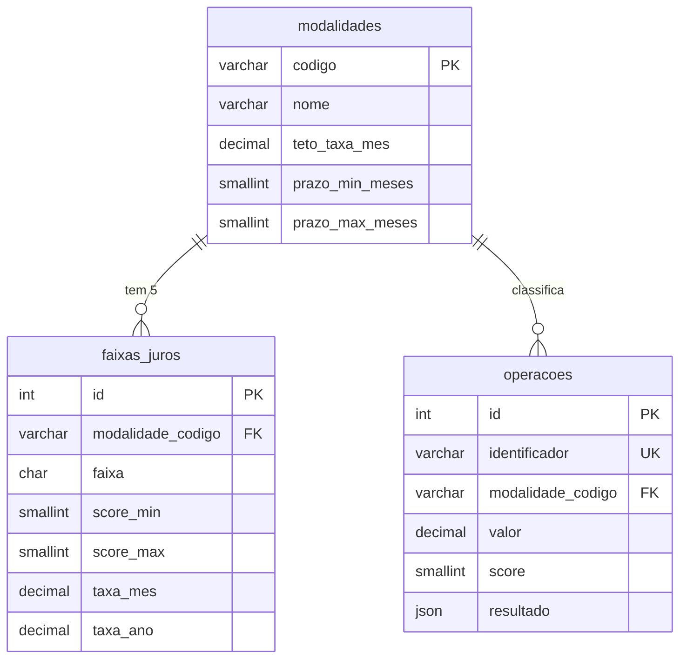

# Backlog do Banco de Dados — versão reduzida (guia de desenvolvimento)

> Esta é a versão **reduzida e focada no banco de dados** do backlog. Ela é irmã do
> `docs/backlog-api.md` (equipe da API) e segue o mesmo formato. O backlog completo do processo
> BPMN continua em `docs/backlog.md` e serve só de contexto.

---

## 1. Visão geral

### O que estamos construindo

Um banco **MySQL 8** com três tabelas e um conjunto de funções JavaScript para consultá-lo:

| Tabela | Guarda | Quem preenche |
|---|---|---|
| `modalidades` | O catálogo dos tipos de crédito que a API simula (6 modalidades PF) | Nós, na carga inicial (`db/seed.sql`) |
| `faixas_juros` | Para cada modalidade, a taxa (mensal **e** anual) de cada **faixa de score** | Nós, na carga inicial |
| `operacoes` | Cada operação de crédito simulada pela API (entrada, taxa aplicada, CET, resultado completo) | A API, a cada `POST /api/operacoes` |

A ideia central, decidida com o produto: **não guardamos várias taxas e vários bancos por
modalidade**. Para cada modalidade escolhemos **uma** taxa de referência e, a partir dela,
montamos as faixas por score. Exemplo real do nosso banco: aquisição de veículos, score 800–1000
paga 1,50% a.m.; score 600–799 paga 2,00% a.m.; score 400–599 paga 2,50% a.m.; e assim por diante.

### As duas fases

**Fase 1 — Pesquisa e definição dos dados** (não precisa de MySQL instalado). O objetivo é sair
com **os números que vão dentro das tabelas** e com o **desenho** das tabelas, ambos revisados.

| Tarefa | Entrega |
|---|---|
| **P-01** | Entender o domínio: modalidade, score, taxa mensal × anual, o que é o dado do BCB |
| **P-02** | Levantar as taxas de mercado por modalidade a partir do dataset do Banco Central |
| **P-03** | Definir os tetos e a tabela final de taxas por modalidade × faixa de score |
| **P-04** | Modelar o banco: diagrama das 3 tabelas e dicionário de dados |

**Fase 2 — Construção do banco e das consultas** (precisa de MySQL).

| Tarefa | Entrega |
|---|---|
| **D-00** | Instalar MySQL 8 + Workbench e conectar |
| **D-01** | `db/schema.sql` — cria o banco e as 3 tabelas |
| **D-02** | `db/seed.sql` — carga inicial: 6 modalidades e 30 faixas de juros |
| **D-03** | Consultas SQL de conferência e de uso (testadas no Workbench) |
| **D-04** | Conexão do Node com o MySQL (`.env`, `mysql2`, `src/db.js`, `/api/health`) |
| **D-05** | Funções JavaScript de consulta (`src/repositorios/`) + script de teste |

### Ordem e paralelismo

```
Fase 1                                   Fase 2
P-01 ── P-02 ── P-03 ──┐                 D-00 (todos, pode ser feito já durante a Fase 1)
                       ├─ P-04 ──────────►  D-01 schema ── D-02 seed ── D-03 consultas SQL ─┐
                       │                          │                                        ├─ D-05 repositórios
                       │                          └── D-04 conexão Node ────────────────────┘
```

- **P-01 → P-02 → P-03** são sequenciais (cada uma usa a anterior). **P-04** pode começar em
  paralelo com a P-02, mas só fecha depois da P-03.
- **D-00** (instalar MySQL) não depende de nada: faça já na primeira semana, porque instalação
  costuma dar problema e é melhor descobrir cedo.
- **D-04** só precisa do banco existir (D-01, passo 1); pode andar em paralelo com D-02 e D-03.
- **D-05** precisa de D-02 (dados) e D-04 (conexão).

### Fronteira com a equipe da API (leia com atenção)

O `backlog-api.md` foi escrito antes de existir uma equipe de banco. Com esta trilha, a divisão
fica assim:

| Item do backlog da API | Quem faz agora | Onde está neste guia |
|---|---|---|
| T-07 **Parte A** (instalar MySQL, `db/schema.sql`, `.env`, `mysql2`, `src/db.js`, `/api/health` com banco) | **Equipe de banco** | D-00, D-01, D-04 |
| T-07 **Parte E** (`src/repositorios/operacoes.js`: `existeIdentificador`, `salvar`, `buscarPorId`) | **Equipe de banco** | D-05 Parte C |
| T-08 **passo 1** (função `listar` paginada no repositório) | **Equipe de banco** | D-05 Parte C |
| T-01 catálogo em `src/dados/modalidades.js` | Equipe da API (continua como está) | — |
| T-07 Parte B `src/dados/faixasRisco.js` | Equipe da API (continua como está) | — |

Regras da fronteira:

1. **Os nomes e assinaturas das funções do repositório são um contrato.** A equipe da API vai
   chamar `repositorio.salvar({...})`, `repositorio.buscarPorId(id)` etc. exatamente como está
   no backlog dela. Não renomeie.
2. **Os números têm de bater.** A taxa que a API calcula (`taxaBase + spread`, limitada ao teto)
   para uma modalidade e um score tem de ser **a mesma** que está gravada em `faixas_juros`. A
   P-03 garante isso. Se o produto mudar uma taxa, muda **nos dois lugares** no mesmo PR.
3. Por enquanto a API lê o catálogo de um arquivo JS (`src/dados/`). Quando este banco estiver
   pronto, a troca para ler do banco (usando `listarModalidades()` e `buscarFaixaPorScore()` da
   D-05) é uma tarefa futura, pequena, da equipe da API.

### Decisões fechadas para esta versão

Não reabra estas decisões durante a implementação — se discordar, levante na reunião.

| Tema | Decisão |
|---|---|
| Banco | **MySQL 8.0.19 ou mais novo** (8.0.4x pelo MySQL Installer é o caminho mais simples; 8.4 LTS também serve). Sem ORM, sem ferramenta de migrations: dois arquivos, `db/schema.sql` (estrutura) e `db/seed.sql` (dados iniciais), ambos podem ser rodados mais de uma vez sem quebrar. |
| Modalidades | As **mesmas 6 do catálogo da API** (`backlog-api.md`, T-01): `CREDITO_PESSOAL`, `CONSIGNADO_INSS`, `CONSIGNADO_PUBLICO`, `CONSIGNADO_PRIVADO`, `VEICULOS`, `OUTROS_BENS`. Financiamento imobiliário fica **fora** (não existe na série do BCB — seria outra fonte). |
| Score | Inteiro de **0 a 1000**, 5 faixas: A 800–1000, B 600–799, C 400–599, D 200–399, E 0–199. **Faixa E = recusado** (não tem taxa). Igual à API. |
| Uma taxa por modalidade × faixa | A tabela `faixas_juros` guarda a **taxa final** de cada faixa, pronta para uso. Não guardamos taxas de vários bancos. A série do BCB serve só como **referência de mercado** (coluna `taxa_referencia_bcb_mes` em `modalidades`). |
| Como os números das faixas são obtidos | `taxa_faixa = min(taxa_base + spread_da_faixa, teto)`, com spreads A +0,00 / B +0,50 / C +1,00 / D +2,00 p.p. — a **mesma fórmula da API** (T-07 Parte B). Assim os dois times sempre concordam. |
| Unidade da taxa | No banco a taxa é em **porcentagem com 2 casas** (`1.85` = 1,85% a.m.). Taxa anual = `((1 + mensal/100)^12 − 1) × 100`, também com 2 casas. |
| Tipos | Dinheiro e taxa sempre em **`DECIMAL`**, nunca `FLOAT`/`DOUBLE` (ponto flutuante erra centavos). Datas em `DATE`/`DATETIME`. Booleanos em `BOOLEAN`. Texto em `VARCHAR` com tamanho. |
| Nomes | No banco, tudo em **`snake_case`** minúsculo (`prazo_meses`). No JavaScript, `camelCase` (`prazoMeses`). A tradução acontece **só** dentro de `src/repositorios/`. |
| Chaves | `modalidades` usa o próprio `codigo` como chave primária (chave **natural**). `faixas_juros` e `operacoes` têm `id` numérico automático (chave **artificial**) e referenciam a modalidade pelo `codigo` (chave estrangeira). |
| Segurança | Senha só no `.env` (fora do git). Toda query com dado vindo de fora usa **`?`** (placeholder), nunca concatenação de string. Sem usuário de banco dedicado — projeto acadêmico, usamos `root` local. |

### Estrutura de pastas ao final

```
calculo-juros/
├─ .env                          ← senha do banco — NUNCA vai para o git (D-04)
├─ .env.example                  ← modelo do .env, sem senha real (D-04)
├─ package.json                  ← ganha mysql2, "--env-file" e "db:teste" (D-04, D-05)
├─ db/
│  ├─ schema.sql                 ← cria banco e as 3 tabelas (D-01)
│  ├─ seed.sql                   ← carga inicial: modalidades e faixas (D-02)
│  ├─ exemplos-operacoes.sql     ← 3 operações de exemplo, só para testar consultas (D-03)
│  ├─ consultas.sql              ← as consultas de conferência e de uso (D-03)
│  ├─ reset.sql                  ← apaga o banco inteiro (cuidado) (D-01)
│  └─ testa-repositorios.mjs     ← script que testa as funções JS contra o banco (D-05)
├─ docs/db/
│  ├─ glossario.md               (P-01)
│  ├─ pesquisa-taxas.md          (P-02, P-03)
│  ├─ taxas-por-faixa.csv        (P-03) ← vira o seed da D-02
│  └─ modelo.md                  (P-04) ← diagrama e dicionário de dados
└─ src/
   ├─ db.js                      ← conexão (pool) com o MySQL (D-04)
   ├─ routes/health.js           ← já existe; ganha checagem do banco (D-04)
   └─ repositorios/              ← TUDO que fala SQL fica aqui (D-05)
      ├─ modalidades.js
      ├─ faixasJuros.js
      └─ operacoes.js
```

### Fluxo de trabalho no Git (vale para todas as tarefas)

Igual ao da equipe da API:

1. `git checkout main` e `git pull` — comece sempre do código mais novo.
2. Crie uma branch com o nome da tarefa: `git checkout -b D-01-schema`.
3. Commits pequenos com mensagem descritiva: `git commit -m "D-01: schema com modalidades, faixas_juros e operacoes"`.
4. `git push -u origin D-01-schema` e abra um **Pull Request** para `main`.
5. **Outra pessoa da equipe revisa** o PR (lê, roda o `.sql` num banco limpo, confere os
   valores esperados). Só depois faz o merge.
6. Nunca dê `git push` direto na `main`. Nunca commite o `.env`.

### Definition of Done (o que "pronto" significa)

- [ ] Todos os **critérios de aceite** da tarefa marcados.
- [ ] Os valores obtidos batem com os **valores esperados** deste guia.
- [ ] Scripts `.sql` rodam **do zero** (depois de `db/reset.sql`) sem erro.
- [ ] PR revisado e aprovado por outro membro.
- [ ] Nenhuma senha, `.env` ou arquivo de experimento commitado.

---

# FASE 1 — Pesquisa e definição dos dados

---

## P-01 — Entender o domínio

**Tempo estimado:** 2 h. **Depende de:** nada. **Entrega:** `docs/db/glossario.md`.

### O que é e por que existe

Antes de desenhar tabela, você precisa saber **o que** vai dentro dela. Esta tarefa é leitura
guiada com perguntas de verificação. Sem ela, os próximos passos viram "copiar e colar sem
entender" — e aí qualquer erro fica invisível.

### Passo a passo

**1. Leia, nesta ordem** (marque o que não entendeu para perguntar):

| Documento | Seções | Por quê |
|---|---|---|
| `docs/research_tabela-juros-brasil_20260831.md` | §1, §2.1–2.5, §3, §4, §6 | É a pesquisa que escolheu o BCB como fonte e explica o que a taxa dele significa |
| `docs/backlog-api.md` | §1 "Visão geral" (inteira) | Decisões que também valem para nós (score, unidade da taxa, formato de erro) |
| `docs/backlog-api.md` | T-01 "Conceitos" e o código do catálogo | Os 6 códigos de modalidade e seus campos — vão virar linhas da tabela `modalidades` |
| `docs/backlog-api.md` | T-07 "Conceitos" → "Score → faixa → spread → taxa" | A regra que gera as faixas |

**2. Responda no papel (ou num arquivo seu, sem commitar)** as perguntas abaixo. As respostas
estão no **Anexo C** — só olhe depois de tentar.

1. O que é uma "modalidade" de crédito? Dê 3 exemplos com o código que a API usa.
2. Uma taxa de **1,85% ao mês** equivale a quanto **ao ano**? (Use a fórmula composta e uma calculadora.)
3. A `TaxaJurosAoMes` publicada pelo BCB é a taxa de juros "pura" do contrato? O que ela inclui?
4. Por que, então, nossa taxa base do consignado INSS (1,60%) é **menor** que a mediana do BCB (1,83%)?
5. Score 650 cai em qual faixa? E 199? E 800?
6. Quem "recebe" a faixa E e o que acontece com o pedido?
7. Para consignado INSS, score 650: `taxa_base 1,60 + spread 0,50 = 2,10`. Qual é a taxa final e por quê?
8. Por que uma taxa deve ser guardada como `DECIMAL(6,2)` e não como `FLOAT`?

**3. Escreva `docs/db/glossario.md`** com **10 termos**, cada um com uma definição de 1–2 linhas
**nas suas palavras** (não copie do documento de pesquisa). Obrigatórios: modalidade, score,
faixa de risco, spread, teto, taxa efetiva mensal, taxa anual (composta), CET, IOF, chave
primária. Este glossário é para vocês mesmos — vai ser consultado o tempo todo.

### Critérios de aceite

- [ ] Todo membro da equipe respondeu as 8 perguntas e conferiu com o Anexo C.
- [ ] `docs/db/glossario.md` existe com os 10 termos, escrito pela equipe.
- [ ] A equipe consegue explicar, sem olhar, a diferença entre "taxa do BCB" e "nossa taxa base".

### Armadilhas comuns

- Achar que taxa anual = mensal × 12. Não: é composta, `(1 + i)^12 − 1`. 1,85% a.m. dá **24,60%
  a.a.**, não 22,20%.
- Confundir "modalidade" (tipo do crédito) com "sistema de amortização" (Price/SAC). Toda
  modalidade aceita os dois sistemas; por isso **não** existe coluna de sistema em `modalidades`.

---

## P-02 — Levantar as taxas de mercado (dataset do BCB)

**Tempo estimado:** 3 h. **Depende de:** P-01. **Entrega:** `docs/db/pesquisa-taxas.md` (parte 1).

### O que é e por que existe

Precisamos de um número de mercado por modalidade para **justificar** a taxa que vamos gravar
no banco (e para gravar como referência). A fonte é o dataset **"Taxas de juros de operações de
crédito por instituição financeira"** do Banco Central. Já existe uma extração no repositório:
`docs/bcb_taxas_juros_2026-08-11_a_2026-08-17.csv` — **790 linhas**, uma por (instituição,
modalidade), semana de 11 a 17/08/2026. Você vai resumir essas 790 linhas em **6 números**
(uma mediana por modalidade).

### Conceitos

- **Uma linha do CSV** = "o banco X praticou, em média, Y% ao mês na modalidade Z nessa semana".
  Colunas que importam: `Segmento` (PESSOA FÍSICA / PESSOA JURÍDICA), `Modalidade`,
  `InstituicaoFinanceira`, `TaxaJurosAoMes`, `TaxaJurosAoAno`.
- **Mediana, não média.** A série tem valores extremos reais (ex.: 0,02% a.m. em crédito pessoal —
  promoção residual de uma financeira). A **média** é puxada por eles; a **mediana** (o valor do
  meio quando se ordena) não. Você vai ver isso nos números.
- **A taxa do BCB já inclui IOF e encargos** (§2.4 da pesquisa). Por isso ela é
  **referência**, não a taxa que gravamos como taxa base.

### Passo a passo

**1. Abra o CSV numa planilha.** O arquivo é UTF-8 com acentos.
- **Google Sheets** (recomendado): Arquivo → Importar → Upload → separador "vírgula". Acentos vêm certos.
- **Excel**: **não** dê duplo clique (os acentos quebram). Use Dados → Obter Dados → De
  Texto/CSV → escolha "65001: Unicode (UTF-8)" → Carregar.

**2. Confira a importação.** Deve ter **790 linhas** de dados + 1 cabeçalho, 11 colunas.
Filtre `Segmento = PESSOA FÍSICA` → **457 linhas**, **10 modalidades** distintas.

**3. Para cada uma das 6 modalidades do nosso catálogo, calcule** `n` (quantas instituições),
`mínimo`, `mediana`, `média`, `máximo` de `TaxaJurosAoMes`, e a `mediana` de `TaxaJurosAoAno`.

Fórmula no Sheets (coluna F = Modalidade, J = TaxaJurosAoMes; adapte as letras):

```
=MEDIAN(FILTER(J:J; F:F="Crédito pessoal consignado INSS - Prefixado"))
=COUNT(FILTER(J:J; F:F="Crédito pessoal consignado INSS - Prefixado"))
```

No Excel 365 as mesmas funções existem com `,` no lugar de `;`. Se sua versão não tiver
`FILTER`, faça na mão: ordene por `Modalidade`, selecione o bloco de linhas daquela modalidade
e use `=MEDIAN(J2:J38)` com o intervalo certo.

O texto da modalidade tem de ser **exatamente** igual ao do CSV (com acento e o sufixo
`- Prefixado`). Copie da própria célula.

**4. Confira contra os valores esperados:**

| Modalidade (texto do BCB) | Código na API | n | mín | **mediana** | média | máx | mediana a.a. |
|---|---|---:|---:|---:|---:|---:|---:|
| Crédito pessoal não consignado - Prefixado | `CREDITO_PESSOAL` | 84 | 0,02 | **5,25** | 6,89 | 17,13 | 84,81 |
| Crédito pessoal consignado INSS - Prefixado | `CONSIGNADO_INSS` | 37 | 1,52 | **1,83** | 1,77 | 1,91 | 24,29 |
| Crédito pessoal consignado público - Prefixado | `CONSIGNADO_PUBLICO` | 46 | 1,49 | **1,84** | 2,25 | 6,48 | 24,48 |
| Crédito pessoal consignado privado - Prefixado | `CONSIGNADO_PRIVADO` | 54 | 1,61 | **3,40** | 3,45 | 5,62 | 49,27 |
| Aquisição de veículos - Prefixado | `VEICULOS` | 39 | 0,39 | **1,77** | 1,81 | 3,36 | 23,40 |
| Aquisição de outros bens - Prefixado | `OUTROS_BENS` | 41 | 0,20 | **2,53** | 3,52 | 8,49 | 34,90 |

Repare: em crédito pessoal a média (6,89) é bem maior que a mediana (5,25) por causa dos
extremos. É por isso que usamos a mediana.

**5. (Opcional, 15 min) Veja a fonte "ao vivo".** Cole no navegador:

```
https://olinda.bcb.gov.br/olinda/servico/taxaJuros/versao/v2/odata/TaxasJurosDiariaPorInicioPeriodo?$format=json&$top=5&$filter=contains(Modalidade,'INSS')
```

Vai aparecer um JSON com 5 registros no mesmo formato do CSV. Isso mostra que a base é pública
e atualizada semanalmente. **Não precisa** baixar uma semana mais nova — a de agosto/2026 basta
para o projeto.

**6. Escreva `docs/db/pesquisa-taxas.md`** com: (a) a tabela do passo 4 preenchida com os seus
números; (b) para cada modalidade, o nome de **2 instituições** e a taxa delas (ex.: no consignado
INSS, Nu Financeira 1,52% e Caixa 1,84%) — para o documento ter exemplos concretos; (c) um
parágrafo de 3–5 linhas explicando **por que a mediana do BCB não pode ser usada diretamente como
nossa taxa** (dica: IOF embutido, §2.4 da pesquisa).

### Critérios de aceite

- [ ] Tabela com os 6 valores de mediana **iguais** aos esperados (2 casas decimais).
- [ ] `n` de cada modalidade bate (84, 37, 46, 54, 39, 41).
- [ ] O documento explica a diferença média × mediana com o exemplo do crédito pessoal.
- [ ] O documento explica por que a taxa do BCB é referência e não taxa base.

### Armadilhas comuns

- Esquecer de filtrar `Segmento = PESSOA FÍSICA`: "Cheque especial" e "Desconto de cheques"
  existem nos dois segmentos e os números misturam.
- Texto da modalidade com espaço a mais ou sem acento → `FILTER` devolve vazio e `MEDIAN` dá erro.
- Planilha com vírgula decimal (pt-BR) importando `1.83` como texto → `MEDIAN` ignora as
  células e devolve um número errado ou `#NUM!`. Confira se a coluna está alinhada à direita (número).

---

## P-03 — Definir tetos e a tabela final de taxas por faixa

**Tempo estimado:** 3 h. **Depende de:** P-02. **Entrega:** `docs/db/pesquisa-taxas.md` (parte 2)
e `docs/db/taxas-por-faixa.csv`.

### O que é e por que existe

Aqui nasce o **conteúdo** da tabela `faixas_juros`: 6 modalidades × 5 faixas = **30 linhas**,
cada uma com taxa mensal e anual. Você não inventa os números: aplica a fórmula fechada
(`min(base + spread, teto)`) sobre a taxa base e o teto de cada modalidade, e registra de onde
veio cada teto.

### Conceitos

**Taxa base e teto vêm do catálogo da API** (`backlog-api.md`, T-01), que são valores
provisórios definidos pela equipe olhando a mediana do BCB:

| Código | Taxa base (faixa A) | Teto | Origem do teto |
|---|---:|---:|---|
| `CREDITO_PESSOAL` | 4,50 | 12,00 | Política nossa |
| `CONSIGNADO_INSS` | 1,60 | **1,85** | **Regulatório** — Resolução CNPS (provisório, ver §6 da pesquisa) |
| `CONSIGNADO_PUBLICO` | 1,60 | 2,50 | Política nossa |
| `CONSIGNADO_PRIVADO` | 2,80 | 4,50 | Política nossa |
| `VEICULOS` | 1,50 | 3,00 | Política nossa |
| `OUTROS_BENS` | 2,20 | 5,00 | Política nossa |

**Teto regulatório × teto de política.** O teto do consignado INSS é imposto por lei (o CNPS
fixa; o STF confirmou em 2026 que pode). Os outros são limites que *nós* escolhemos para o
produto não ficar absurdo. A diferença importa para o documento, não para a tabela — a coluna é
a mesma (`teto_taxa_mes`).

**Faixas e spreads (iguais à API):**

| Faixa | Score | Spread | Taxa da faixa |
|---|---|---:|---|
| A | 800–1000 | +0,00 | `min(base + 0,00, teto)` |
| B | 600–799 | +0,50 | `min(base + 0,50, teto)` |
| C | 400–599 | +1,00 | `min(base + 1,00, teto)` |
| D | 200–399 | +2,00 | `min(base + 2,00, teto)` |
| E | 0–199 | — | **sem taxa** (recusado) |

**Taxa anual** a partir da mensal: `anual = ((1 + mensal/100)^12 − 1) × 100`, arredondada a 2
casas. Na planilha: `=ROUND(((1 + B2/100)^12 - 1) * 100; 2)`.

### Passo a passo

**1. Na planilha, monte 30 linhas** com as colunas exatamente nesta ordem e com estes nomes
(vão ser lidas pela D-02):

```
modalidade_codigo,faixa,score_min,score_max,taxa_mes,taxa_ano
```

Para a faixa E, deixe `taxa_mes` e `taxa_ano` **vazios**.

**2. Calcule `taxa_mes`** com a fórmula `=MIN(base + spread; teto)` e **`taxa_ano`** com a
fórmula acima. Use fórmulas, não digite os números — assim, se o produto mudar uma taxa base,
você troca um número e tudo se recalcula.

**3. Confira contra o Anexo A** (tabela completa dos 30 valores). Alguns pontos de atenção:

- `CONSIGNADO_INSS`: B, C e D ficam todas em **1,85** — o teto "achata" as faixas. É esperado.
- `VEICULOS` D: 1,50 + 2,00 = 3,50 → teto **3,00**.
- `CREDITO_PESSOAL` D: 6,50% a.m. = **112,91% a.a.** — sim, mais que dobra em um ano. É o que
  esse mercado pratica (o BCB mostrou máximo de 17,13% a.m.).

**4. Exporte como CSV** para `docs/db/taxas-por-faixa.csv` (separador vírgula, ponto decimal —
no Sheets: Arquivo → Download → CSV; se sua planilha estiver em pt-BR e sair `1,85`, troque a
configuração regional para "Estados Unidos" antes de exportar, ou substitua `,`→`.` no editor de texto).

**5. Complete `docs/db/pesquisa-taxas.md`** com a parte 2: a tabela de taxa base/teto/origem
(com o link da fonte do teto do INSS: a notícia da Agência Brasil e a ressalva de que o valor
precisa ser confirmado no DOU — §6 da pesquisa), e a tabela das 30 faixas.

### Critérios de aceite

- [ ] `docs/db/taxas-por-faixa.csv` tem 30 linhas + cabeçalho, com os nomes de coluna exatos.
- [ ] Todos os 24 valores de `taxa_mes` (A–D) e `taxa_ano` são **iguais** ao Anexo A.
- [ ] Nenhuma `taxa_mes` maior que o teto da modalidade.
- [ ] As 6 linhas da faixa E têm `taxa_mes` e `taxa_ano` vazios.
- [ ] O documento cita a origem de cada teto e a ressalva sobre o teto do INSS.

### Armadilhas comuns

- Aplicar o teto **antes** de somar o spread (ou não aplicar): `CONSIGNADO_PUBLICO` C tem de dar
  2,50 (1,60 + 1,00 = 2,60 → teto), não 2,60.
- Calcular a taxa anual com `× 12`: 1,85 × 12 = 22,20 (errado); composta = 24,60 (certo).
- Arredondar a taxa anual antes de multiplicar por 100 (dá 0,25 em vez de 24,60).

---

## P-04 — Modelar o banco (diagrama e dicionário de dados)

**Tempo estimado:** 3 h. **Depende de:** P-03 (para saber os campos). **Entrega:** `docs/db/modelo.md`.

### O que é e por que existe

Antes de escrever `CREATE TABLE`, desenha-se. O **modelo** mostra as tabelas, as colunas, os
tipos e como elas se ligam. É o que a equipe da API vai olhar para saber "onde está o quê", e é
o que o revisor usa para conferir o `schema.sql` da D-01.

### Conceitos

- **Chave primária (PK)** — a coluna que identifica uma linha sem ambiguidade. Não pode repetir
  nem ser nula.
  - **Natural**: um dado que já é único por natureza — o `codigo` da modalidade
    (`VEICULOS`). Usamos em `modalidades`.
  - **Artificial**: um número inventado só para identificar (`id INT AUTO_INCREMENT`). Usamos
    em `faixas_juros` e `operacoes`, porque não há um dado natural curto e único.
- **Chave estrangeira (FK)** — uma coluna que "aponta" para a PK de outra tabela. O banco
  **impede** que você grave uma faixa para uma modalidade que não existe, ou que apague uma
  modalidade que tem operações. É a **integridade referencial**.
- **UNIQUE** — não pode repetir, mas não é a PK (ex.: `identificador` da operação, ou o par
  `(modalidade_codigo, faixa)`).
- **CHECK** — regra que o banco valida em toda gravação (ex.: `score_min <= score_max`).
- **NULL** — "sem valor". Usamos em `taxa_mes` da faixa E para dizer "não tem taxa". Toda outra
  coluna é `NOT NULL`.
- **Tipos:** `DECIMAL(6,2)` = até 6 dígitos, 2 depois da vírgula (máx. 9999,99). `DECIMAL(15,2)`
  para valores em reais. `SMALLINT UNSIGNED` = inteiro de 0 a 65535 (score, prazo).
  `VARCHAR(40)` = texto de até 40 caracteres. `DATE` = só data. `DATETIME` = data e hora.
  `JSON` = documento JSON (o resultado completo da simulação). `BOOLEAN` = verdadeiro/falso.

### Passo a passo

**1. Desenhe o diagrama.** Use **Mermaid** (o GitHub renderiza sozinho dentro do `.md`).
Comece do esqueleto abaixo e complete as colunas usando o Anexo B como gabarito **depois** de
tentar sozinho — a ideia é você pensar em cada coluna: "de que tipo é? pode ser nula? é única?".



`||--o{` lê-se "um para muitos": **uma** modalidade tem **várias** faixas e **várias** operações.

**2. Escreva o dicionário de dados**: uma tabela por entidade, com colunas `coluna | tipo |
nulo? | descrição | exemplo`. Para cada coluna, uma linha de descrição **em português claro**
("taxa mensal em %, 2 casas; NULL só na faixa E"). O gabarito completo de colunas está no Anexo B.

**3. Registre as decisões** numa seção "Decisões de modelagem", com 1–2 linhas cada:
por que `codigo` é PK natural; por que `taxa_ano` é gravada em vez de calculada na hora;
por que `resultado` é `JSON` (a API guarda a resposta inteira, com 24 parcelas, sem criar tabela
de parcelas — decisão de escopo da API); por que `score_min/score_max` se repetem por
modalidade (permite que, no futuro, uma modalidade tenha cortes de score diferentes).

**4. Peça revisão** a alguém da equipe da API: as colunas de `operacoes` têm de ser suficientes
para o `INSERT` da T-07 Parte E e o `SELECT` de listagem da T-08.

### Critérios de aceite

- [ ] `docs/db/modelo.md` tem o diagrama Mermaid com as 3 tabelas, todas as colunas e as 2 relações.
- [ ] Dicionário de dados cobre **todas** as colunas do Anexo B, com tipo, nulidade e descrição.
- [ ] Seção "Decisões de modelagem" com as 4 decisões acima.
- [ ] Um membro da equipe da API revisou e aprovou o PR.

### Armadilhas comuns

- Colocar `FLOAT` em taxa ou valor. **Sempre `DECIMAL`.**
- Esquecer o `UNIQUE (modalidade_codigo, faixa)` — sem ele dá para gravar duas faixas "B" para a
  mesma modalidade e a consulta por score devolve 2 linhas.
- Modelar uma tabela `bancos`/`instituicoes`. **Decisão fechada:** não guardamos taxa por banco.

---

# FASE 2 — Construção do banco e das consultas

---

## D-00 — Instalar MySQL 8 e o Workbench

**Tempo estimado:** 1 h (mais se a instalação der problema — por isso comece cedo).
**Depende de:** nada. Pode ser feito durante a Fase 1.

### Passo a passo

**1. Instale o servidor MySQL.** Duas opções, escolha uma:

- **MySQL Installer (Windows, recomendado para quem nunca usou):**
  <https://dev.mysql.com/downloads/installer/> → baixe o instalador **8.0.x** ("mysql-installer-
  community") → "Developer Default" (instala servidor + **MySQL Workbench**, a interface gráfica).
  Na etapa de senha do `root`, anote a senha (sugestão para o projeto: `senha123` — é local, não
  vai para lugar nenhum). Deixe a porta padrão **3306**. A versão 8.0.4x atende ao requisito
  (≥ 8.0.19).
- **MySQL 8.4 LTS (Windows/Mac/Linux):** também serve, mas são dois downloads separados —
  servidor em <https://dev.mysql.com/downloads/mysql/> e Workbench em
  <https://dev.mysql.com/downloads/workbench/>.
- **Docker** (só se já tiver Docker funcionando — ele exige virtualização e não roda em toda
  máquina): `docker run --name mysql-juros -e MYSQL_ROOT_PASSWORD=senha123 -p 3306:3306 -d mysql:8.4`
  e instale só o Workbench pelo link acima.

**2. Conecte pelo Workbench.** Abra o Workbench → na tela inicial, clique na conexão
"Local instance MySQL80" (ou "MySQL84"; se não existir, crie: `+` → Hostname `127.0.0.1`,
Port `3306`, Username `root`) → digite a senha. Abre uma aba de consulta.

**3. Primeiro comando.** Na aba, digite e execute (⚡ raio, ou `Ctrl+Enter`):

```sql
SELECT VERSION();
```

Esperado: uma célula com `8.0.xx`, `8.4.x` ou `9.x`. Precisa ser **8.0.19 ou mais novo**
(usamos sintaxe de `INSERT ... AS novo ON DUPLICATE KEY UPDATE`, que é de 8.0.19).

**4. Desligue o "safe updates"** (senão o Workbench bloqueia `UPDATE`/`DELETE` sem `WHERE`
por chave e dá erro 1175): Edit → Preferences → SQL Editor → desmarque "Safe Updates" → **feche e
reabra a conexão**.

**5. Linha de comando (opcional, mas útil).** No terminal, `mysql --version`. Se não achar,
adicione a pasta `bin` do MySQL ao PATH (Windows: `C:\Program Files\MySQL\MySQL Server 8.0\bin`).
Depois `mysql -u root -p` entra no prompt `mysql>`; `exit` sai.

### Critérios de aceite

- [ ] `SELECT VERSION();` responde no Workbench com versão ≥ 8.0.19.
- [ ] Você sabe a senha do `root` e a porta (3306).
- [ ] Safe updates desligado.

### Armadilhas comuns

- Porta 3306 já em uso (outro MySQL/XAMPP instalado antes) → o serviço não sobe. Desinstale o
  antigo ou use outra porta e anote (vai no `.env` da D-04).
- Windows: o serviço "MySQL80" parado → `services.msc` → MySQL80 → Iniciar.
- Esqueceu a senha do root → mais rápido desinstalar e reinstalar do que recuperar.

---

## D-01 — `db/schema.sql`: criar o banco e as 3 tabelas

**Tempo estimado:** 3 h. **Depende de:** D-00, P-04. **Arquivos:** cria `db/schema.sql`, `db/reset.sql`.

### O que é e por que existe

É o modelo da P-04 virando comandos. O arquivo tem de poder ser rodado **várias vezes** sem
erro (`CREATE ... IF NOT EXISTS`), para que qualquer pessoa da equipe monte o banco do zero na
máquina dela com um único comando.

### Conceitos

- **DDL** (Data Definition Language) = comandos que criam/alteram estrutura: `CREATE`, `ALTER`,
  `DROP`. **DML** = comandos de dados: `INSERT`, `SELECT`, `UPDATE`, `DELETE`.
- **Ordem importa:** uma tabela com FK só pode ser criada **depois** da tabela que ela referencia.
  Logo: `modalidades` → `faixas_juros` → `operacoes`.
- **`utf8mb4`** = codificação que aceita qualquer caractere (acentos, emoji). `utf8` do MySQL é
  incompleto — sempre `utf8mb4`.
- **`AUTO_INCREMENT`** = o banco gera o próximo número sozinho no `INSERT`.
- **`ON DELETE RESTRICT`** (padrão) = o banco **recusa** apagar uma modalidade que tem faixas ou
  operações. É o que queremos: nunca perder histórico.

### Passo a passo

**1. Crie `db/schema.sql`.** O código está completo porque é o contrato entre as equipes —
**leia cada linha e o comentário dela** antes de copiar:

```sql
-- =====================================================================
-- Schema do banco calculo_juros. Pode ser executado várias vezes sem erro.
-- Ordem: modalidades -> faixas_juros -> operacoes (por causa das chaves estrangeiras).
-- Convenção: nomes em snake_case; taxas em % com 2 casas (1.85 = 1,85% a.m.).
-- =====================================================================

CREATE DATABASE IF NOT EXISTS calculo_juros
  CHARACTER SET utf8mb4 COLLATE utf8mb4_unicode_ci;
USE calculo_juros;

-- ---------------------------------------------------------------------
-- modalidades: catálogo dos tipos de crédito (6 modalidades PF).
-- Chave primária NATURAL: o próprio código (ex.: 'VEICULOS').
-- ---------------------------------------------------------------------
CREATE TABLE IF NOT EXISTS modalidades (
  codigo                   VARCHAR(40)       NOT NULL,  -- ex.: 'CONSIGNADO_INSS' (mesmo da API)
  nome                     VARCHAR(80)       NOT NULL,  -- ex.: 'Crédito pessoal consignado INSS'
  modalidade_bcb           VARCHAR(120)      NOT NULL,  -- texto exato da série do BCB (rastreabilidade)
  publico                  CHAR(2)           NOT NULL DEFAULT 'PF',        -- 'PF' ou 'PJ'
  regime_indexacao         VARCHAR(20)       NOT NULL DEFAULT 'PREFIXADO',
  teto_taxa_mes            DECIMAL(6,2)      NOT NULL,  -- taxa máxima permitida (% a.m.)
  taxa_referencia_bcb_mes  DECIMAL(6,2)      NULL,      -- mediana BCB 11-17/08/2026 (inclui IOF) — só comparação
  prazo_min_meses          SMALLINT UNSIGNED NOT NULL,
  prazo_max_meses          SMALLINT UNSIGNED NOT NULL,
  descricao                VARCHAR(255)      NULL,
  ativo                    BOOLEAN           NOT NULL DEFAULT TRUE,  -- FALSE = não aparece mais para simular
  criado_em                DATETIME          NOT NULL DEFAULT CURRENT_TIMESTAMP,
  PRIMARY KEY (codigo),
  CONSTRAINT ck_modalidades_prazo CHECK (prazo_min_meses >= 1 AND prazo_max_meses >= prazo_min_meses),
  CONSTRAINT ck_modalidades_teto  CHECK (teto_taxa_mes > 0)
);

-- ---------------------------------------------------------------------
-- faixas_juros: para cada modalidade, a taxa de cada faixa de score.
-- 5 faixas por modalidade (A..E). Faixa E = recusado => taxa NULL.
-- ---------------------------------------------------------------------
CREATE TABLE IF NOT EXISTS faixas_juros (
  id                 INT UNSIGNED      NOT NULL AUTO_INCREMENT,
  modalidade_codigo  VARCHAR(40)       NOT NULL,          -- FK -> modalidades.codigo
  faixa              CHAR(1)           NOT NULL,          -- 'A' (melhor) .. 'E' (recusado)
  score_min          SMALLINT UNSIGNED NOT NULL,          -- inclusive
  score_max          SMALLINT UNSIGNED NOT NULL,          -- inclusive
  taxa_mes           DECIMAL(6,2)      NULL,              -- % a.m.; NULL só na faixa E
  taxa_ano           DECIMAL(6,2)      NULL,              -- % a.a. = ((1+mes/100)^12 - 1)*100
  descricao          VARCHAR(80)       NULL,              -- ex.: 'Risco baixo'
  PRIMARY KEY (id),
  UNIQUE KEY uk_faixas_modalidade_faixa (modalidade_codigo, faixa),
  CONSTRAINT fk_faixas_modalidade FOREIGN KEY (modalidade_codigo) REFERENCES modalidades (codigo),
  CONSTRAINT ck_faixas_letra CHECK (faixa IN ('A', 'B', 'C', 'D', 'E')),
  CONSTRAINT ck_faixas_score CHECK (score_min <= score_max AND score_max <= 1000),
  -- faixa E não tem taxa; as outras têm obrigatoriamente
  CONSTRAINT ck_faixas_taxa  CHECK ((faixa = 'E' AND taxa_mes IS NULL) OR (faixa <> 'E' AND taxa_mes IS NOT NULL))
);

-- ---------------------------------------------------------------------
-- operacoes: cada operação simulada pela API (POST /api/operacoes).
-- Colunas "planas" servem para listagem; `resultado` guarda a resposta completa.
-- ---------------------------------------------------------------------
CREATE TABLE IF NOT EXISTS operacoes (
  id                      INT UNSIGNED      NOT NULL AUTO_INCREMENT,
  identificador           VARCHAR(60)       NOT NULL,   -- vem do cliente da API; único
  modalidade_codigo       VARCHAR(40)       NOT NULL,   -- FK -> modalidades.codigo
  valor                   DECIMAL(15,2)     NOT NULL,   -- valor solicitado (R$)
  score                   SMALLINT UNSIGNED NOT NULL,   -- 0..1000
  prazo_meses             SMALLINT UNSIGNED NOT NULL,
  data_liberacao          DATE              NOT NULL,
  primeiro_relacionamento BOOLEAN           NOT NULL DEFAULT FALSE,
  faixa_risco             CHAR(1)           NOT NULL,   -- faixa usada na precificação (A..D)
  taxa_final_mes          DECIMAL(8,4)      NOT NULL,   -- % a.m. aplicada
  cet_price_ano           DECIMAL(8,2)      NOT NULL,   -- CET % a.a. no sistema Price
  cet_sac_ano             DECIMAL(8,2)      NOT NULL,   -- CET % a.a. no sistema SAC
  resultado               JSON              NOT NULL,   -- resposta completa: { entrada, taxa, simulacoes }
  criado_em               DATETIME          NOT NULL DEFAULT CURRENT_TIMESTAMP,
  PRIMARY KEY (id),
  UNIQUE KEY uk_operacoes_identificador (identificador),
  CONSTRAINT fk_operacoes_modalidade FOREIGN KEY (modalidade_codigo) REFERENCES modalidades (codigo),
  CONSTRAINT ck_operacoes_valor CHECK (valor > 0),
  CONSTRAINT ck_operacoes_score CHECK (score <= 1000)
);
```

**2. Crie `db/reset.sql`** — apaga **tudo** (use só em desenvolvimento, para recomeçar do zero):

```sql
-- CUIDADO: apaga o banco inteiro, inclusive as operações gravadas.
DROP DATABASE IF EXISTS calculo_juros;
```

**3. Execute o schema.** No Workbench: File → Open SQL Script → `db/schema.sql` → ⚡ (executa
tudo). Pela linha de comando: `mysql -u root -p < db/schema.sql`.

**4. Confira:**

```sql
SHOW TABLES FROM calculo_juros;
```
Esperado: 3 linhas — `faixas_juros`, `modalidades`, `operacoes`.

```sql
DESCRIBE calculo_juros.faixas_juros;
```
Esperado: 8 linhas (uma por coluna), `id` com `auto_increment`, `taxa_mes` com `Null = YES`.

```sql
SELECT TABLE_NAME, CONSTRAINT_NAME, CONSTRAINT_TYPE
  FROM information_schema.TABLE_CONSTRAINTS
 WHERE TABLE_SCHEMA = 'calculo_juros'
 ORDER BY TABLE_NAME, CONSTRAINT_TYPE;
```
Esperado: 3 `PRIMARY KEY`, 2 `FOREIGN KEY`, 2 `UNIQUE`, 7 `CHECK`.

**5. Prove que rodar duas vezes não quebra:** execute o `schema.sql` de novo → nenhum erro.
Depois execute `reset.sql` e o `schema.sql` de novo → as 3 tabelas voltam vazias. **Commit → PR.**

### Critérios de aceite

- [ ] `db/schema.sql` cria o banco do zero e pode ser rodado 2× sem erro.
- [ ] As 3 tabelas existem com **todas** as colunas do Anexo B, tipos e nulidade corretos.
- [ ] As 2 FKs, os 2 UNIQUE e os 7 CHECKs aparecem no `information_schema`.
- [ ] `db/reset.sql` existe e tem o aviso de cuidado.
- [ ] O diagrama de `docs/db/modelo.md` bate com o schema (se mudou algo, atualize o modelo no mesmo PR).

### Armadilhas comuns

- `Error 1215: Cannot add foreign key constraint` → a tabela referenciada ainda não existe
  (ordem errada) ou o tipo/charset da coluna FK é diferente da PK (`VARCHAR(40)` nos dois lados).
- `Error 3819: Check constraint ... is violated` só aparece no `INSERT`, não no `CREATE`. É
  sinal de que o CHECK está funcionando.
- Esquecer o `USE calculo_juros;` e criar as tabelas em outro banco (ex.: `sys`). Confira com
  `SHOW TABLES FROM calculo_juros`.
- Workbench executa **só a linha selecionada** se houver seleção. Para rodar o arquivo inteiro,
  não selecione nada e use o raio "Execute all".

---

## D-02 — `db/seed.sql`: carga inicial (6 modalidades + 30 faixas)

**Tempo estimado:** 3 h. **Depende de:** D-01, P-03. **Arquivos:** cria `db/seed.sql`.

### O que é e por que existe

"Seed" (semente) é o script que coloca os **dados de referência** no banco: sem ele o banco
existe mas está vazio e a API não tem o que consultar. Os números vêm de
`docs/db/taxas-por-faixa.csv` (P-03) e da tabela da P-02.

### Conceitos

- **`INSERT ... VALUES (...), (...), (...)`** grava várias linhas de uma vez.
- **Idempotência**: queremos rodar o seed quantas vezes for preciso (ex.: corrigimos uma taxa)
  **sem** duplicar linhas e **sem** apagar operações. A construção
  `INSERT ... AS novo ON DUPLICATE KEY UPDATE coluna = novo.coluna` faz isso: se a chave
  (PK ou UNIQUE) já existe, **atualiza** em vez de dar erro 1062. Precisa do MySQL ≥ 8.0.19.
- **`NULL`** em SQL se escreve literalmente `NULL` (sem aspas).

### Passo a passo

**1. Crie `db/seed.sql`.** A parte das modalidades está pronta; a das faixas você monta a partir
do seu CSV (está mostrada a estrutura e as 5 primeiras linhas — as outras 25 são iguais no formato):

```sql
USE calculo_juros;

-- ---------------------------------------------------------------------
-- 1) Modalidades — mesmas 6 do catálogo da API (backlog-api.md, T-01).
--    taxa_referencia_bcb_mes = mediana da série do BCB 11-17/08/2026 (docs/db/pesquisa-taxas.md).
-- ---------------------------------------------------------------------
INSERT INTO modalidades
  (codigo, nome, modalidade_bcb, publico, regime_indexacao,
   teto_taxa_mes, taxa_referencia_bcb_mes, prazo_min_meses, prazo_max_meses, descricao)
VALUES
  ('CREDITO_PESSOAL',    'Crédito pessoal não consignado',      'Crédito pessoal não consignado - Prefixado',      'PF', 'PREFIXADO', 12.00, 5.25,  3, 48, 'Empréstimo sem garantia, pago em parcelas mensais.'),
  ('CONSIGNADO_INSS',    'Crédito pessoal consignado INSS',     'Crédito pessoal consignado INSS - Prefixado',     'PF', 'PREFIXADO',  1.85, 1.83,  6, 84, 'Parcelas descontadas diretamente do benefício do INSS. Teto regulatório CNPS (provisório).'),
  ('CONSIGNADO_PUBLICO', 'Crédito pessoal consignado público',  'Crédito pessoal consignado público - Prefixado',  'PF', 'PREFIXADO',  2.50, 1.84,  6, 96, 'Parcelas descontadas em folha de servidor público.'),
  ('CONSIGNADO_PRIVADO', 'Crédito pessoal consignado privado',  'Crédito pessoal consignado privado - Prefixado',  'PF', 'PREFIXADO',  4.50, 3.40,  6, 48, 'Parcelas descontadas em folha de empresa privada.'),
  ('VEICULOS',           'Aquisição de veículos',               'Aquisição de veículos - Prefixado',               'PF', 'PREFIXADO',  3.00, 1.77, 12, 60, 'Financiamento de veículo com o bem em garantia.'),
  ('OUTROS_BENS',        'Aquisição de outros bens',            'Aquisição de outros bens - Prefixado',            'PF', 'PREFIXADO',  5.00, 2.53,  3, 36, 'Financiamento de bens duráveis (eletrodomésticos, móveis etc.).')
AS novo
ON DUPLICATE KEY UPDATE
  nome = novo.nome, modalidade_bcb = novo.modalidade_bcb, publico = novo.publico,
  regime_indexacao = novo.regime_indexacao, teto_taxa_mes = novo.teto_taxa_mes,
  taxa_referencia_bcb_mes = novo.taxa_referencia_bcb_mes, prazo_min_meses = novo.prazo_min_meses,
  prazo_max_meses = novo.prazo_max_meses, descricao = novo.descricao;

-- ---------------------------------------------------------------------
-- 2) Faixas de juros — 6 modalidades x 5 faixas = 30 linhas.
--    Fonte: docs/db/taxas-por-faixa.csv (P-03). Faixa E = recusado (taxa NULL).
--    Regra: taxa_mes = MIN(taxa_base + spread, teto); spreads A 0,00 / B 0,50 / C 1,00 / D 2,00.
-- ---------------------------------------------------------------------
INSERT INTO faixas_juros
  (modalidade_codigo, faixa, score_min, score_max, taxa_mes, taxa_ano, descricao)
VALUES
  ('CREDITO_PESSOAL', 'A', 800, 1000, 4.50,  69.59, 'Risco muito baixo'),
  ('CREDITO_PESSOAL', 'B', 600,  799, 5.00,  79.59, 'Risco baixo'),
  ('CREDITO_PESSOAL', 'C', 400,  599, 5.50,  90.12, 'Risco médio'),
  ('CREDITO_PESSOAL', 'D', 200,  399, 6.50, 112.91, 'Risco alto'),
  ('CREDITO_PESSOAL', 'E',   0,  199, NULL,   NULL, 'Recusado: score abaixo do mínimo'),
  -- ... as outras 5 modalidades, 5 linhas cada, na mesma ordem A..E (valores no Anexo A) ...
AS novo
ON DUPLICATE KEY UPDATE
  score_min = novo.score_min, score_max = novo.score_max,
  taxa_mes = novo.taxa_mes, taxa_ano = novo.taxa_ano, descricao = novo.descricao;
```

Dica: abra `taxas-por-faixa.csv` no editor e use "localizar e substituir" para transformar
cada linha em `('X', 'A', 800, 1000, 4.50, 69.59, '...'),`. A última linha termina **sem**
vírgula, antes do `AS novo`.

**2. Execute** o `seed.sql` (Workbench ou `mysql -u root -p < db/seed.sql`).

**3. Confira:**

```sql
SELECT COUNT(*) FROM modalidades;      -- esperado: 6
SELECT COUNT(*) FROM faixas_juros;     -- esperado: 30
SELECT COUNT(*) FROM faixas_juros WHERE taxa_mes IS NULL;   -- esperado: 6 (as faixas E)
```

```sql
-- Cada modalidade tem 5 faixas cobrindo 0..1000 sem buraco nem sobreposição:
SELECT modalidade_codigo, COUNT(*) AS faixas, MIN(score_min) AS de, MAX(score_max) AS ate,
       SUM(score_max - score_min + 1) AS pontos_cobertos
  FROM faixas_juros
 GROUP BY modalidade_codigo;
```
Esperado: 6 linhas, todas com `faixas 5`, `de 0`, `ate 1000`, `pontos_cobertos 1001`.
(Se der 1002, duas faixas se sobrepõem; se der 1000, falta um ponto — ex.: 799/801.)

```sql
-- Nenhuma faixa acima do teto da modalidade:
SELECT f.modalidade_codigo, f.faixa, f.taxa_mes, m.teto_taxa_mes
  FROM faixas_juros f
  JOIN modalidades m ON m.codigo = f.modalidade_codigo
 WHERE f.taxa_mes > m.teto_taxa_mes;
```
Esperado: **0 linhas**.

```sql
-- taxa_ano confere com a fórmula composta (2 casas)?
-- (comparamos com tolerância de meio centavo, porque POW devolve ponto flutuante)
SELECT modalidade_codigo, faixa, taxa_mes, taxa_ano,
       ROUND((POW(1 + taxa_mes / 100, 12) - 1) * 100, 2) AS taxa_ano_calculada
  FROM faixas_juros
 WHERE taxa_mes IS NOT NULL
   AND ABS(taxa_ano - (POW(1 + taxa_mes / 100, 12) - 1) * 100) > 0.005;
```
Esperado: **0 linhas**. Se aparecer alguma, a `taxa_ano` do CSV está errada nessa linha.
Para **ver** a conferência lado a lado (30 linhas), rode a mesma consulta sem a última linha do `WHERE`.

**4. Rode o seed de novo.** Nenhum erro, e as contagens continuam 6 e 30 (não duplicou).

**5. Teste que o banco se defende** (todos estes **devem dar erro** — o erro é o resultado esperado):

| Comando | Erro esperado | Por quê |
|---|---|---|
| `INSERT INTO faixas_juros (modalidade_codigo, faixa, score_min, score_max, taxa_mes, taxa_ano) VALUES ('IMOVEIS','A',800,1000,1.00,12.68);` | `1452 Cannot add or update a child row: a foreign key constraint fails` | Modalidade não existe (FK) |
| `INSERT INTO faixas_juros (modalidade_codigo, faixa, score_min, score_max, taxa_mes, taxa_ano) VALUES ('VEICULOS','B',600,799,2.00,26.82);` | `1062 Duplicate entry 'VEICULOS-B'` | Já existe a faixa B (UNIQUE) |
| `INSERT INTO faixas_juros (modalidade_codigo, faixa, score_min, score_max, taxa_mes, taxa_ano) VALUES ('VEICULOS','F',0,0,1.00,12.68);` | `3819 Check constraint 'ck_faixas_letra' is violated` | Faixa só pode ser A–E (CHECK) |
| `DELETE FROM modalidades WHERE codigo = 'VEICULOS';` | `1451 Cannot delete or update a parent row` | Tem faixas apontando para ela (FK) |

**Commit → PR.**

### Critérios de aceite

- [ ] `seed.sql` grava 6 modalidades e 30 faixas; rodar 2× não duplica nem dá erro.
- [ ] As 4 consultas de conferência do passo 3 dão os resultados esperados (6/30/6; 5-0-1000-1001; 0 linhas; 0 linhas).
- [ ] Os 4 comandos "que devem falhar" falham com os erros indicados.
- [ ] `taxa_referencia_bcb_mes` de cada modalidade é a mediana da P-02.

### Armadilhas comuns

- `You have an error in your SQL syntax ... near 'AS novo'` → MySQL abaixo de 8.0.19. Atualize
  (ou, em último caso, troque por `ON DUPLICATE KEY UPDATE nome = VALUES(nome), ...` — sintaxe antiga).
- Vírgula depois da última linha do `VALUES` → erro de sintaxe apontando para `AS`.
- Digitar `'NULL'` com aspas → grava o texto "NULL" e o CHECK `ck_faixas_taxa` reclama.
- Acento quebrado no `nome` ("Crédito") → o arquivo foi salvo em outra codificação. Salve como
  UTF-8 (VS Code: barra inferior → "UTF-8").

---

## D-03 — Consultas SQL de uso e de conferência

**Tempo estimado:** 3 h. **Depende de:** D-02. **Arquivos:** cria `db/consultas.sql`, `db/exemplos-operacoes.sql`.

### O que é e por que existe

Antes de escrever JavaScript, cada consulta que a API vai precisar é escrita e testada **em SQL
puro**, no Workbench, onde o erro aparece na hora. As funções da D-05 são só "embrulhos" dessas
consultas. Este arquivo também serve de documentação: "como pergunto X ao banco?".

### Conceitos

- **`SELECT colunas FROM tabela WHERE condição ORDER BY coluna`** — o básico. Sempre liste as
  colunas; `SELECT *` esconde o que você realmente usa.
- **`JOIN`** — junta duas tabelas pela FK: `FROM faixas_juros f JOIN modalidades m ON m.codigo = f.modalidade_codigo`.
  `f` e `m` são apelidos (alias) para escrever menos.
- **`BETWEEN a AND b`** — inclusivo nos dois lados. `650 BETWEEN 600 AND 799` é verdadeiro.
- **`LIMIT n OFFSET k`** — devolve `n` linhas pulando as `k` primeiras: paginação. **Sempre
  com `ORDER BY`**, senão a ordem entre páginas não é garantida.
- **`->>`** — extrai um valor de dentro de uma coluna `JSON`: `resultado->>'$.taxa.taxaFinalMes'`.
- **Placeholders**: onde abaixo aparece `'CONSIGNADO_INSS'` ou `650`, na D-05 vai entrar um `?`.

### Passo a passo

**1. Crie `db/exemplos-operacoes.sql`** com 3 operações de teste (a tabela `operacoes` é
preenchida pela API; para testar consultas antes de a API existir, inserimos à mão). O `resultado`
aqui é um JSON **resumido** só para teste — o real, gravado pela API, é a resposta completa:

```sql
USE calculo_juros;
-- Somente para desenvolvimento/testes. Valores do cenário A.5 do backlog-api.md.
INSERT INTO operacoes
  (identificador, modalidade_codigo, valor, score, prazo_meses, data_liberacao, primeiro_relacionamento,
   faixa_risco, taxa_final_mes, cet_price_ano, cet_sac_ano, resultado)
VALUES
  ('OP-TESTE-0001', 'CONSIGNADO_INSS', 10000.00, 650, 12, '2026-10-30', TRUE,  'B', 1.8500, 30.89, 30.96,
   '{"entrada":{"valor":10000,"modalidade":"CONSIGNADO_INSS","score":650,"prazoMeses":12,"dataLiberacao":"2026-10-30","primeiroRelacionamento":true},"taxa":{"faixaRisco":"B","taxaBaseMes":1.60,"spreadMes":0.50,"tetoTaxaMes":1.85,"taxaFinalMes":1.85,"tetoAplicado":true},"simulacoes":{"PRICE":{"parcelaFixa":936.91,"cet":{"anualPercentual":30.89,"mensalPercentual":2.27}},"SAC":{"amortizacaoBase":833.33,"cet":{"anualPercentual":30.96,"mensalPercentual":2.27}}}}'),
  ('OP-TESTE-0002', 'CREDITO_PESSOAL', 5000.00,  720, 24, '2026-11-05', FALSE, 'B', 5.0000, 85.12, 84.90,
   '{"entrada":{"valor":5000,"modalidade":"CREDITO_PESSOAL","score":720,"prazoMeses":24},"taxa":{"faixaRisco":"B","taxaFinalMes":5.00,"tetoAplicado":false},"simulacoes":{"PRICE":{"cet":{"anualPercentual":85.12}},"SAC":{"cet":{"anualPercentual":84.90}}}}'),
  ('OP-TESTE-0003', 'VEICULOS',        35000.00, 810, 36, '2026-11-03', FALSE, 'A', 1.5000, 24.12, 24.30,
   '{"entrada":{"valor":35000,"modalidade":"VEICULOS","score":810,"prazoMeses":36},"taxa":{"faixaRisco":"A","taxaFinalMes":1.50,"tetoAplicado":false},"simulacoes":{"PRICE":{"cet":{"anualPercentual":24.12}},"SAC":{"cet":{"anualPercentual":24.30}}}}');
```

(Os CETs das operações 2 e 3 são ilustrativos — servem para testar consulta, não cálculo.)

**2. Crie `db/consultas.sql`** com as consultas abaixo, cada uma precedida de um comentário
`-- Qn: o que ela responde` e do resultado esperado. Execute uma a uma e confira.

```sql
USE calculo_juros;

-- Q1: Listar modalidades ativas (vai virar GET /api/modalidades).
-- Esperado: 6 linhas, em ordem alfabética de código; CONSIGNADO_INSS com teto 1.85.
SELECT codigo, nome, teto_taxa_mes, taxa_referencia_bcb_mes, prazo_min_meses, prazo_max_meses
  FROM modalidades
 WHERE ativo = TRUE
 ORDER BY codigo;

-- Q2: Uma modalidade pelo código.
-- Esperado: 1 linha (VEICULOS, prazo 12..60). Com 'NAO_EXISTE' → 0 linhas (não é erro!).
SELECT codigo, nome, teto_taxa_mes, prazo_min_meses, prazo_max_meses, descricao, ativo
  FROM modalidades
 WHERE codigo = 'VEICULOS';

-- Q3: Faixas de uma modalidade, com o nome da modalidade (JOIN), da melhor para a pior.
-- Esperado: 5 linhas; A 1.50 / B 2.00 / C 2.50 / D 3.00 / E NULL.
SELECT m.nome, f.faixa, f.score_min, f.score_max, f.taxa_mes, f.taxa_ano, f.descricao
  FROM faixas_juros f
  JOIN modalidades m ON m.codigo = f.modalidade_codigo
 WHERE f.modalidade_codigo = 'VEICULOS'
 ORDER BY f.score_min DESC;

-- Q4: A CONSULTA PRINCIPAL — qual a taxa para (modalidade, score)?
-- Esperado: 1 linha: faixa B, taxa_mes 1.85, taxa_ano 24.60.
--   Troque 650 por 150 → faixa E, taxa_mes NULL (recusado).
--   Troque 650 por 800 → faixa A, 1.60. Por 799 → faixa B. (limites inclusivos)
--   Troque por 1500 → 0 linhas (score fora de 0..1000: a API valida antes; aqui só não acha).
SELECT faixa, score_min, score_max, taxa_mes, taxa_ano
  FROM faixas_juros
 WHERE modalidade_codigo = 'CONSIGNADO_INSS'
   AND 650 BETWEEN score_min AND score_max;

-- Q5: Tabela completa de taxas (para conferência visual / documentação): 30 linhas.
SELECT f.modalidade_codigo, f.faixa, f.score_min, f.score_max, f.taxa_mes, f.taxa_ano
  FROM faixas_juros f
 ORDER BY f.modalidade_codigo, f.faixa;

-- Q6: Existe operação com este identificador? (vai virar existeIdentificador)
-- Esperado: 1 linha com 'OP-TESTE-0001'; com 'OP-NAO-EXISTE' → 0 linhas.
SELECT id FROM operacoes WHERE identificador = 'OP-TESTE-0001' LIMIT 1;

-- Q7: Uma operação completa pelo id (vai virar buscarPorId).
-- Esperado: 1 linha; a coluna resultado mostra o JSON.
SELECT id, identificador, criado_em, resultado
  FROM operacoes
 WHERE id = 1;

-- Q8: Listagem paginada, mais recente primeiro (vai virar listar) — página 1, 2 por página.
-- Esperado: 2 linhas: ids 3 e 2. Com OFFSET 2 → 1 linha: id 1.
SELECT id, identificador, modalidade_codigo, valor, score, prazo_meses, data_liberacao,
       faixa_risco, taxa_final_mes, cet_price_ano, cet_sac_ano, criado_em
  FROM operacoes
 ORDER BY id DESC
 LIMIT 2 OFFSET 0;

-- Q9: Total de operações (para totalPaginas). Esperado: 3.
SELECT COUNT(*) AS total FROM operacoes;

-- Q10: Ler um valor de dentro do JSON.
-- Esperado: 3 linhas; OP-TESTE-0001 com taxa_json 1.85 e cet_price_json 30.89.
SELECT identificador,
       resultado->>'$.taxa.taxaFinalMes'                    AS taxa_json,
       resultado->>'$.simulacoes.PRICE.cet.anualPercentual'  AS cet_price_json
  FROM operacoes;

-- Q11: Operações com o nome da modalidade e quantas por modalidade (JOIN + GROUP BY).
-- Esperado: 3 linhas, cada modalidade com 1 operação e o valor total dela.
SELECT m.nome, COUNT(o.id) AS operacoes, SUM(o.valor) AS valor_total
  FROM operacoes o
  JOIN modalidades m ON m.codigo = o.modalidade_codigo
 GROUP BY m.nome
 ORDER BY valor_total DESC;
```

**3. Teste as defesas da tabela `operacoes`** (devem dar **erro**):

| Comando | Erro esperado |
|---|---|
| Inserir de novo `OP-TESTE-0001` (repita a 1ª linha do exemplo) | `1062 Duplicate entry 'OP-TESTE-0001'` |
| Inserir com `modalidade_codigo = 'IMOVEIS'` | `1452 ... foreign key constraint fails` |
| Inserir com `valor = 0` | `3819 Check constraint 'ck_operacoes_valor' is violated` |

**4. Commit → PR.** No PR, cole o print (ou a saída) da Q4 com score 650 e com 150.

### Critérios de aceite

- [ ] `db/exemplos-operacoes.sql` insere 3 operações sem erro num banco recém-criado (schema + seed).
- [ ] As 11 consultas de `db/consultas.sql` rodam e dão os resultados esperados nos comentários.
- [ ] Q4 devolve exatamente 1 linha para qualquer score de 0 a 1000 (teste 0, 199, 200, 399, 400, 599, 600, 799, 800, 1000).
- [ ] Os 3 comandos de defesa falham com os erros indicados.

### Armadilhas comuns

- `Unknown column 'f.taxa_mes'` → esqueceu o alias `f` no `FROM faixas_juros f`.
- Q4 devolvendo 2 linhas → há sobreposição de faixas no seed (ex.: 600–800 e 800–1000). A
  conferência `pontos_cobertos = 1001` da D-02 pega isso.
- `LIMIT 2 OFFSET 0` sem `ORDER BY id DESC` → "funciona" hoje e quebra amanhã. Sempre ordene.
- JSON com aspas simples dentro (`'...'`) quebra a string SQL. JSON usa **aspas duplas** por
  definição; a string SQL vai entre aspas simples.

---

## D-04 — Conexão do Node com o MySQL

**Tempo estimado:** 2 h. **Depende de:** D-00, D-01. **Arquivos:** cria `.env`, `.env.example`,
`src/db.js`; altera `.gitignore`, `package.json`, `index.js`, `src/routes/health.js`.

> Esta tarefa é a **Parte A (A4–A7) da T-07** do backlog da API, agora sob responsabilidade da
> equipe de banco. O código é o mesmo — está reproduzido aqui para o guia ser autossuficiente.

### O que é e por que existe

O Node precisa saber **onde** está o banco (host, porta) e **com que senha** entrar. Isso não
pode ficar no código (a senha iria para o GitHub). Fica num arquivo `.env`, ignorado pelo git, que
o Node lê na inicialização. A biblioteca `mysql2` faz a conversa com o MySQL.

### Conceitos

- **Variável de ambiente** = um par `NOME=valor` que o sistema entrega ao programa. No Node,
  `process.env.DB_PASSWORD`. A flag `--env-file=.env` (Node ≥ 20.6) carrega o arquivo.
- **Pool de conexões** — abrir conexão com o banco é lento (~50 ms). O pool abre algumas e
  reaproveita. Regra: **nunca** `createConnection` por requisição; sempre `pool.query`.
- **`decimalNumbers` / `dateStrings`** — por padrão o `mysql2` devolve `DECIMAL` como **string**
  (`"10000.00"`) e `DATE` como objeto `Date` com fuso horário. Queremos número e `'AAAA-MM-DD'`.

### Passo a passo

**1. Crie `.env.example`** (vai para o git, **sem** senha real):

```
DB_HOST=localhost
DB_PORT=3306
DB_USER=root
DB_PASSWORD=coloque-a-senha-aqui
DB_NAME=calculo_juros
PORT=3000
```

**2. Copie para `.env`** (`cp .env.example .env`) e preencha a senha real do seu MySQL.

**3. Adicione `.env` ao `.gitignore`** em uma linha própria. Atenção: o arquivo atual termina
em `claudedocs/` **sem** quebra de linha — se você só colar `.env` no final, vira `claudedocs/.env`
e não funciona. Abra o arquivo, dê Enter depois de `claudedocs/` e escreva `.env` na linha nova.
Rode `git status` e confirme que `.env` **não** aparece na lista. Se aparecer, pare e corrija
antes de qualquer commit.

**4. Instale a biblioteca e ajuste o `package.json`:** `npm install mysql2`. Depois, em `scripts`
e `engines`:

```json
"scripts": {
  "start": "node --env-file=.env index.js",
  "dev": "node --watch --env-file=.env index.js",
  "test": "node --test"
},
"engines": { "node": ">=20.6" }
```

(Se a equipe da API já tiver adicionado `"test"`, mantenha o deles.)

**5. Em `index.js`**, troque `const PORT = 3000;` por `const PORT = Number(process.env.PORT ?? 3000);`.

**6. Crie `src/db.js`** (copie como está e leia os comentários):

```js
import mysql from 'mysql2/promise';

// Um "pool" mantém algumas conexões abertas e reaproveita — nunca abra uma conexão por requisição.
export const pool = mysql.createPool({
  host: process.env.DB_HOST,
  port: Number(process.env.DB_PORT ?? 3306),
  user: process.env.DB_USER,
  password: process.env.DB_PASSWORD,
  database: process.env.DB_NAME,
  waitForConnections: true,
  connectionLimit: 10,
  decimalNumbers: true, // sem isto, colunas DECIMAL voltam como STRING ("10000.00")
  dateStrings: true,    // sem isto, DATE volta como objeto Date com fuso — queremos 'AAAA-MM-DD'
});
```

**7. Faça o `/api/health` checar o banco.** Substitua o conteúdo de `src/routes/health.js`:

```js
import { Router } from 'express';
import { pool } from '../db.js';

const router = Router();

router.get('/', async (req, res) => {
  try {
    await pool.query('SELECT 1');
    res.json({ status: 'ok', mensagem: 'API está ok', banco: 'ok' });
  } catch (err) {
    console.error(err);
    res.status(503).json({ status: 'erro', mensagem: 'API está ok, mas o banco não respondeu', banco: 'erro' });
  }
});

export default router;
```

**8. Teste:** `npm run dev` → no Postman (ou navegador) `GET http://localhost:3000/api/health` →
`200` com `banco: "ok"`. Pare o serviço do MySQL → `503` com `banco: "erro"`. Ligue de novo → `200`.
**Commit → PR.** No PR, confira na aba "Files changed" que **não** existe `.env`.

### Critérios de aceite

- [ ] `.env` está no `.gitignore` e não aparece no PR; `.env.example` está no repo sem senha real.
- [ ] `npm run dev` sobe e `/api/health` responde `banco: "ok"`; com MySQL parado, `503`.
- [ ] `src/db.js` tem `decimalNumbers: true` e `dateStrings: true`.
- [ ] `index.js` lê a porta de `process.env.PORT`.

### Armadilhas comuns

- `node: .env: not found` → não existe o `.env` (só o `.example`). Copie.
- `ER_ACCESS_DENIED_ERROR` → senha errada no `.env`. `ECONNREFUSED 127.0.0.1:3306` → MySQL parado
  ou porta diferente. `ER_BAD_DB_ERROR` → o banco `calculo_juros` não foi criado (rode o `schema.sql`).
- `Error: Cannot find module 'mysql2/promise'` → `npm install mysql2` não foi rodado nesta máquina.
- Commitou o `.env` sem querer → não basta apagar no próximo commit: a senha fica no histórico.
  Avise a equipe, troque a senha do MySQL e peça ajuda para reescrever o histórico.

---

## D-05 — Funções JavaScript de consulta (`src/repositorios/`)

**Tempo estimado:** 5 h. **Depende de:** D-02, D-03, D-04. **Arquivos:** cria
`src/repositorios/modalidades.js`, `src/repositorios/faixasJuros.js`, `src/repositorios/operacoes.js`,
`db/testa-repositorios.mjs`; altera `package.json`.

> As funções da **Parte C** são a **Parte E da T-07** e o **passo 1 da T-08** do backlog da API.
> Os nomes e o formato de retorno são o contrato com a equipe da API — **não mude**.

### O que é e por que existe

Cada consulta da D-03 vira uma função `async` que recebe parâmetros, executa o SQL com
placeholders (`?`) e devolve objetos JavaScript em `camelCase`. Quem chama (a rota, o serviço)
não sabe que existe SQL. Regra de ouro das camadas: **tudo que fala SQL fica em `src/repositorios/`**.

### Conceitos

- **`const [linhas] = await pool.query(sql, [parametros])`** — `query` devolve um array
  `[linhas, metadados]`; a desestruturação `[linhas]` pega só o primeiro. Para `INSERT`, o
  primeiro item é um objeto com `insertId`.
- **Placeholders `?`** — o `mysql2` substitui cada `?` pelo parâmetro correspondente **com
  escape**. Isso impede **SQL injection**: se alguém mandar `identificador = "x'; DROP TABLE
  operacoes; --"`, vira só um texto esquisito, não um comando. **Nunca** monte SQL com `+` ou
  template string contendo dado de fora.
- **Tradução snake_case → camelCase** acontece **só aqui**, numa função `linhaPara...` por
  tabela. Assim, se uma coluna mudar de nome, muda-se em um lugar.
- **`BOOLEAN` volta como `0`/`1`**; converta com `=== 1`. **`NULL` volta como `null`**.

### Passo a passo

**Parte A — `src/repositorios/modalidades.js`** (código completo; leia e copie):

```js
import { pool } from '../db.js';

// Traduz uma linha do banco (snake_case) para o objeto que a API usa (camelCase).
function linhaParaModalidade(linha) {
  return {
    codigo: linha.codigo,
    nome: linha.nome,
    modalidadeBcb: linha.modalidade_bcb,
    publico: linha.publico,
    regimeIndexacao: linha.regime_indexacao,
    tetoTaxaMes: linha.teto_taxa_mes,
    taxaReferenciaBcbMes: linha.taxa_referencia_bcb_mes,
    prazoMinMeses: linha.prazo_min_meses,
    prazoMaxMeses: linha.prazo_max_meses,
    descricao: linha.descricao,
    ativo: linha.ativo === 1,
  };
}

const COLUNAS = `codigo, nome, modalidade_bcb, publico, regime_indexacao, teto_taxa_mes,
                 taxa_referencia_bcb_mes, prazo_min_meses, prazo_max_meses, descricao, ativo`;

// Lista as modalidades ativas, em ordem de código. (Q1)
export async function listarModalidades() {
  const [linhas] = await pool.query(
    `SELECT ${COLUNAS} FROM modalidades WHERE ativo = TRUE ORDER BY codigo`);
  return linhas.map(linhaParaModalidade);
}

// Uma modalidade pelo código, ou undefined se não existir. (Q2)
export async function buscarModalidade(codigo) {
  const [linhas] = await pool.query(
    `SELECT ${COLUNAS} FROM modalidades WHERE codigo = ?`, [codigo]);
  return linhas.length === 0 ? undefined : linhaParaModalidade(linhas[0]);
}
```

(`COLUNAS` é uma constante nossa, sem dado de usuário — por isso pode ir na template string.
O `codigo`, que vem de fora, vai no `?`.)

**Parte B — `src/repositorios/faixasJuros.js`** (roteiro; escreva você, no mesmo estilo da Parte A):

```js
import { pool } from '../db.js';

function linhaParaFaixa(linha) {
  // devolva { faixa, scoreMin, scoreMax, taxaMes, taxaAno, descricao,
  //           permiteContratacao: linha.taxa_mes !== null }
}

// Todas as faixas de uma modalidade, da melhor (A) para a pior (E). (Q3)
export async function listarFaixas(modalidadeCodigo) {
  // SELECT faixa, score_min, score_max, taxa_mes, taxa_ano, descricao FROM faixas_juros
  //  WHERE modalidade_codigo = ? ORDER BY score_min DESC
  // return linhas.map(linhaParaFaixa)
}

// A faixa (e a taxa) para uma modalidade e um score. (Q4)
// Devolve undefined se a modalidade não existir ou o score estiver fora de 0..1000.
export async function buscarFaixaPorScore(modalidadeCodigo, score) {
  // mesma SELECT, com WHERE modalidade_codigo = ? AND ? BETWEEN score_min AND score_max
  // parâmetros: [modalidadeCodigo, score]   ← a ORDEM dos ? é a ordem do array
}
```

**Parte C — `src/repositorios/operacoes.js`** (contrato com a API; código completo):

```js
import { pool } from '../db.js';

// Devolve true se já existe operação com esse identificador. (Q6)
export async function existeIdentificador(identificador) {
  const [linhas] = await pool.query(
    'SELECT id FROM operacoes WHERE identificador = ? LIMIT 1', [identificador]);
  return linhas.length > 0;
}

// Grava a operação e devolve o id gerado. `entrada`, `taxa` e `simulacoes` vêm da API (T-07).
export async function salvar({ identificador, entrada, taxa, simulacoes }) {
  const [resultado] = await pool.query(
    `INSERT INTO operacoes
       (identificador, modalidade_codigo, valor, score, prazo_meses, data_liberacao,
        primeiro_relacionamento, faixa_risco, taxa_final_mes, cet_price_ano, cet_sac_ano, resultado)
     VALUES (?, ?, ?, ?, ?, ?, ?, ?, ?, ?, ?, ?)`,
    [
      identificador, entrada.modalidade, entrada.valor, entrada.score, entrada.prazoMeses,
      entrada.dataLiberacao, entrada.primeiroRelacionamento ? 1 : 0,
      taxa.faixaRisco, taxa.taxaFinalMes,
      simulacoes.PRICE.cet.anualPercentual, simulacoes.SAC.cet.anualPercentual,
      JSON.stringify({ entrada, taxa, simulacoes }),
    ],
  );
  return resultado.insertId;
}

// Busca uma operação completa pelo id (ou undefined). (Q7)
export async function buscarPorId(id) {
  const [linhas] = await pool.query(
    'SELECT id, identificador, criado_em, resultado FROM operacoes WHERE id = ?', [id]);
  if (linhas.length === 0) return undefined;
  const linha = linhas[0];
  // mysql2 já converte a coluna JSON em objeto; se em algum ambiente vier como texto, use JSON.parse.
  const resultado = typeof linha.resultado === 'string' ? JSON.parse(linha.resultado) : linha.resultado;
  return { id: linha.id, identificador: linha.identificador, criadoEm: linha.criado_em, ...resultado };
}

// Lista um resumo das operações, mais recentes primeiro, e o total para paginação. (Q8 + Q9)
export async function listar({ pagina, tamanho }) {
  const offset = (pagina - 1) * tamanho;
  const [linhas] = await pool.query(
    `SELECT id, identificador, modalidade_codigo, valor, score, prazo_meses, data_liberacao,
            faixa_risco, taxa_final_mes, cet_price_ano, cet_sac_ano, criado_em
       FROM operacoes
      ORDER BY id DESC
      LIMIT ? OFFSET ?`,
    [tamanho, offset], // precisam ser NÚMEROS, não strings
  );
  const [[{ total }]] = await pool.query('SELECT COUNT(*) AS total FROM operacoes');
  const itens = linhas.map((l) => ({
    id: l.id,
    identificador: l.identificador,
    modalidade: l.modalidade_codigo,   // a API chama de "modalidade" (contrato da T-08)
    valor: l.valor,
    score: l.score,
    prazoMeses: l.prazo_meses,
    dataLiberacao: l.data_liberacao,
    faixaRisco: l.faixa_risco,
    taxaFinalMes: l.taxa_final_mes,
    cetPriceAno: l.cet_price_ano,
    cetSacAno: l.cet_sac_ano,
    criadoEm: l.criado_em,
  }));
  return { itens, total };
}
```

**Parte D — o script de teste `db/testa-repositorios.mjs`.** Testa contra o banco real (com
`seed.sql` e `exemplos-operacoes.sql` carregados). Está completo — leia, entenda cada `assert`,
e complete os dois `TODO`:

```js
// Roda com: npm run db:teste   (precisa do MySQL ligado, schema + seed + exemplos carregados)
import assert from 'node:assert/strict';
import { pool } from '../src/db.js';
import { listarModalidades, buscarModalidade } from '../src/repositorios/modalidades.js';
import { listarFaixas, buscarFaixaPorScore } from '../src/repositorios/faixasJuros.js';
import * as operacoes from '../src/repositorios/operacoes.js';

let passou = 0;
async function teste(nome, fn) {
  try { await fn(); passou++; console.log('✔', nome); }
  catch (e) { console.log('✘', nome, '\n   ', e.message); process.exitCode = 1; }
}

await teste('listarModalidades devolve as 6, em ordem, em camelCase', async () => {
  const lista = await listarModalidades();
  assert.equal(lista.length, 6);
  assert.equal(lista[0].codigo, 'CONSIGNADO_INSS');
  assert.equal(lista[0].tetoTaxaMes, 1.85);          // número, não "1.85"
  assert.equal(typeof lista[0].prazoMinMeses, 'number');
  assert.equal(lista[0].ativo, true);                 // boolean, não 1
});

await teste('buscarModalidade: existente e inexistente', async () => {
  const v = await buscarModalidade('VEICULOS');
  assert.equal(v.prazoMaxMeses, 60);
  assert.equal(await buscarModalidade('NAO_EXISTE'), undefined);
});

await teste('listarFaixas VEICULOS: 5 faixas, A primeiro, E sem taxa', async () => {
  const faixas = await listarFaixas('VEICULOS');
  assert.equal(faixas.length, 5);
  assert.equal(faixas[0].faixa, 'A');
  assert.equal(faixas[0].taxaMes, 1.5);
  assert.equal(faixas[4].faixa, 'E');
  assert.equal(faixas[4].taxaMes, null);
  assert.equal(faixas[4].permiteContratacao, false);
});

await teste('buscarFaixaPorScore: INSS 650 → B 1.85 / 24.60', async () => {
  const f = await buscarFaixaPorScore('CONSIGNADO_INSS', 650);
  assert.equal(f.faixa, 'B');
  assert.equal(f.taxaMes, 1.85);
  assert.equal(f.taxaAno, 24.6);
  assert.equal(f.permiteContratacao, true);
});

await teste('buscarFaixaPorScore: limites e recusa', async () => {
  assert.equal((await buscarFaixaPorScore('CREDITO_PESSOAL', 800)).faixa, 'A');
  assert.equal((await buscarFaixaPorScore('CREDITO_PESSOAL', 799)).faixa, 'B');
  assert.equal((await buscarFaixaPorScore('CREDITO_PESSOAL', 720)).taxaMes, 5.0);
  const e = await buscarFaixaPorScore('CREDITO_PESSOAL', 150);
  assert.equal(e.faixa, 'E');
  assert.equal(e.permiteContratacao, false);
  assert.equal(await buscarFaixaPorScore('CREDITO_PESSOAL', 1500), undefined);
  assert.equal(await buscarFaixaPorScore('NAO_EXISTE', 650), undefined);
});

await teste('operacoes.existeIdentificador', async () => {
  assert.equal(await operacoes.existeIdentificador('OP-TESTE-0001'), true);
  assert.equal(await operacoes.existeIdentificador('OP-NAO-EXISTE'), false);
});

await teste('operacoes.buscarPorId devolve o JSON "aberto" e datas como string', async () => {
  const op = await operacoes.buscarPorId(1);
  assert.equal(op.identificador, 'OP-TESTE-0001');
  assert.equal(op.taxa.taxaFinalMes, 1.85);           // veio de dentro do JSON
  assert.equal(op.entrada.dataLiberacao, '2026-10-30');
  assert.equal(typeof op.criadoEm, 'string');          // dateStrings: true
  assert.equal(await operacoes.buscarPorId(999999), undefined);
});

await teste('operacoes.listar pagina e conta', async () => {
  const p1 = await operacoes.listar({ pagina: 1, tamanho: 2 });
  assert.ok(p1.total >= 3);
  assert.equal(p1.itens.length, 2);
  assert.ok(p1.itens[0].id > p1.itens[1].id);         // mais recente primeiro
  assert.equal(p1.itens[0].modalidade !== undefined, true); // campo "modalidade", não "modalidade_codigo"
  // TODO: chame listar({ pagina: 2, tamanho: 2 }) e verifique que nenhum id se repete com a página 1.
});

await teste('operacoes.salvar grava e devolve id; duplicado dá erro do banco', async () => {
  const identificador = `OP-SMOKE-${Date.now()}`;      // único a cada execução
  const dados = {
    identificador,
    entrada: { valor: 1000, modalidade: 'OUTROS_BENS', score: 500, prazoMeses: 6,
               dataLiberacao: '2026-12-01', primeiroRelacionamento: false },
    taxa: { faixaRisco: 'C', taxaBaseMes: 2.2, spreadMes: 1.0, tetoTaxaMes: 5.0, taxaFinalMes: 3.2, tetoAplicado: false },
    simulacoes: { PRICE: { cet: { anualPercentual: 50.0 } }, SAC: { cet: { anualPercentual: 49.5 } } },
  };
  const id = await operacoes.salvar(dados);
  assert.ok(Number.isInteger(id) && id > 0);
  const op = await operacoes.buscarPorId(id);
  assert.equal(op.entrada.modalidade, 'OUTROS_BENS');
  await assert.rejects(() => operacoes.salvar(dados), (e) => e.code === 'ER_DUP_ENTRY');
  // TODO: tente salvar com entrada.modalidade = 'IMOVEIS' e verifique e.code === 'ER_NO_REFERENCED_ROW_2'
});

console.log(`\n${passou} teste(s) passaram.`);
await pool.end(); // fecha o pool; sem isto o processo fica pendurado
```

**Parte E — script npm.** Em `package.json`, dentro de `scripts`:
`"db:teste": "node --env-file=.env db/testa-repositorios.mjs"`. Rode `npm run db:teste`.
Esperado: 9 linhas com ✔ e `9 teste(s) passaram.`

**Commit → PR.** Peça que **alguém da equipe da API** revise a Parte C.

### Critérios de aceite

- [ ] `npm run db:teste` passa com 9 ✔ num banco recém-montado (`reset` → `schema` → `seed` → `exemplos`).
- [ ] Nenhuma função monta SQL com `+` ou template string contendo dado de fora; todo dado de fora vai em `?`.
- [ ] Todo retorno é `camelCase`; `DECIMAL` volta como número, `BOOLEAN` como `true/false`, `DATE` como `'AAAA-MM-DD'`.
- [ ] `listar` devolve `modalidade` (não `modalidade_codigo`) — contrato da T-08.
- [ ] `buscarFaixaPorScore` devolve `undefined` para modalidade inexistente **e** para score fora de 0–1000, e `permiteContratacao: false` na faixa E.
- [ ] Os dois `TODO` do script foram completados.

### Armadilhas comuns

- Trocar a ordem dos parâmetros: `[score, modalidadeCodigo]` com `WHERE modalidade_codigo = ? AND ? BETWEEN` → sempre `undefined`. A ordem dos `?` é a ordem do array.
- `assert.equal(f.taxaMes, 1.85)` falha com `'1.85' !== 1.85` → faltou `decimalNumbers: true` no pool (D-04).
- `LIMIT ? OFFSET ?` com strings (`'2'`) → erro de sintaxe SQL. Converta com `Number` antes de chamar (a rota da T-08 faz isso).
- O script "não termina" → faltou o `await pool.end()` no fim.
- `ER_NO_REFERENCED_ROW_2` ao salvar uma operação → `entrada.modalidade` não existe em `modalidades`. Isso é o FK funcionando: a API deve validar antes (T-07 Parte C), e o banco é a última barreira.

---

## Anexo A — Tabela de taxas por modalidade × faixa (valores esperados da P-03 / D-02)

Regra: `taxa_mes = min(base + spread, teto)`; spreads A +0,00 / B +0,50 / C +1,00 / D +2,00;
`taxa_ano = ((1 + taxa_mes/100)^12 − 1) × 100`, 2 casas. Em **negrito**, as faixas em que o teto atuou.

| modalidade_codigo | base | teto | faixa | score_min | score_max | taxa_mes | taxa_ano |
|---|---:|---:|---|---:|---:|---:|---:|
| CREDITO_PESSOAL | 4,50 | 12,00 | A | 800 | 1000 | 4,50 | 69,59 |
| CREDITO_PESSOAL | | | B | 600 | 799 | 5,00 | 79,59 |
| CREDITO_PESSOAL | | | C | 400 | 599 | 5,50 | 90,12 |
| CREDITO_PESSOAL | | | D | 200 | 399 | 6,50 | 112,91 |
| CREDITO_PESSOAL | | | E | 0 | 199 | NULL | NULL |
| CONSIGNADO_INSS | 1,60 | 1,85 | A | 800 | 1000 | 1,60 | 20,98 |
| CONSIGNADO_INSS | | | B | 600 | 799 | **1,85** | 24,60 |
| CONSIGNADO_INSS | | | C | 400 | 599 | **1,85** | 24,60 |
| CONSIGNADO_INSS | | | D | 200 | 399 | **1,85** | 24,60 |
| CONSIGNADO_INSS | | | E | 0 | 199 | NULL | NULL |
| CONSIGNADO_PUBLICO | 1,60 | 2,50 | A | 800 | 1000 | 1,60 | 20,98 |
| CONSIGNADO_PUBLICO | | | B | 600 | 799 | 2,10 | 28,32 |
| CONSIGNADO_PUBLICO | | | C | 400 | 599 | **2,50** | 34,49 |
| CONSIGNADO_PUBLICO | | | D | 200 | 399 | **2,50** | 34,49 |
| CONSIGNADO_PUBLICO | | | E | 0 | 199 | NULL | NULL |
| CONSIGNADO_PRIVADO | 2,80 | 4,50 | A | 800 | 1000 | 2,80 | 39,29 |
| CONSIGNADO_PRIVADO | | | B | 600 | 799 | 3,30 | 47,64 |
| CONSIGNADO_PRIVADO | | | C | 400 | 599 | 3,80 | 56,45 |
| CONSIGNADO_PRIVADO | | | D | 200 | 399 | **4,50** | 69,59 |
| CONSIGNADO_PRIVADO | | | E | 0 | 199 | NULL | NULL |
| VEICULOS | 1,50 | 3,00 | A | 800 | 1000 | 1,50 | 19,56 |
| VEICULOS | | | B | 600 | 799 | 2,00 | 26,82 |
| VEICULOS | | | C | 400 | 599 | 2,50 | 34,49 |
| VEICULOS | | | D | 200 | 399 | **3,00** | 42,58 |
| VEICULOS | | | E | 0 | 199 | NULL | NULL |
| OUTROS_BENS | 2,20 | 5,00 | A | 800 | 1000 | 2,20 | 29,84 |
| OUTROS_BENS | | | B | 600 | 799 | 2,70 | 37,67 |
| OUTROS_BENS | | | C | 400 | 599 | 3,20 | 45,93 |
| OUTROS_BENS | | | D | 200 | 399 | 4,20 | 63,84 |
| OUTROS_BENS | | | E | 0 | 199 | NULL | NULL |

Conferência cruzada com a API (Anexo A.5 do `backlog-api.md`): `CONSIGNADO_INSS` + score 650 →
1,85 (teto aplicado); `CREDITO_PESSOAL` + score 720 → 5,00. Os dois batem com esta tabela.

## Anexo B — Dicionário de dados (gabarito da P-04 e da D-01)

### `modalidades`

| coluna | tipo | nulo? | descrição | exemplo |
|---|---|---|---|---|
| `codigo` | VARCHAR(40) | não (PK) | Código usado pela API | `CONSIGNADO_INSS` |
| `nome` | VARCHAR(80) | não | Nome para exibição | Crédito pessoal consignado INSS |
| `modalidade_bcb` | VARCHAR(120) | não | Texto exato da série do BCB (rastreabilidade) | Crédito pessoal consignado INSS - Prefixado |
| `publico` | CHAR(2) | não | `PF` ou `PJ` (só PF nesta versão) | PF |
| `regime_indexacao` | VARCHAR(20) | não | `PREFIXADO` nesta versão | PREFIXADO |
| `teto_taxa_mes` | DECIMAL(6,2) | não | Taxa máxima permitida, % a.m. | 1.85 |
| `taxa_referencia_bcb_mes` | DECIMAL(6,2) | sim | Mediana BCB 11–17/08/2026, % a.m.; inclui IOF; só comparação | 1.83 |
| `prazo_min_meses` | SMALLINT UNSIGNED | não | Prazo mínimo | 6 |
| `prazo_max_meses` | SMALLINT UNSIGNED | não | Prazo máximo | 84 |
| `descricao` | VARCHAR(255) | sim | Texto livre | Parcelas descontadas do benefício… |
| `ativo` | BOOLEAN | não | `FALSE` esconde a modalidade sem apagar histórico | TRUE |
| `criado_em` | DATETIME | não | Preenchido pelo banco | 2026-09-22 10:00:00 |

### `faixas_juros`

| coluna | tipo | nulo? | descrição | exemplo |
|---|---|---|---|---|
| `id` | INT UNSIGNED | não (PK, auto) | Identificador artificial | 7 |
| `modalidade_codigo` | VARCHAR(40) | não (FK) | → `modalidades.codigo` | VEICULOS |
| `faixa` | CHAR(1) | não | A (melhor) a E (recusado); UNIQUE com a modalidade | B |
| `score_min` | SMALLINT UNSIGNED | não | Score mínimo, inclusive | 600 |
| `score_max` | SMALLINT UNSIGNED | não | Score máximo, inclusive (≤ 1000) | 799 |
| `taxa_mes` | DECIMAL(6,2) | sim | % a.m.; NULL **só** na faixa E | 2.00 |
| `taxa_ano` | DECIMAL(6,2) | sim | % a.a. composta; NULL só na faixa E | 26.82 |
| `descricao` | VARCHAR(80) | sim | Rótulo | Risco baixo |

### `operacoes`

| coluna | tipo | nulo? | descrição | exemplo |
|---|---|---|---|---|
| `id` | INT UNSIGNED | não (PK, auto) | Id devolvido pela API | 1 |
| `identificador` | VARCHAR(60) | não (UNIQUE) | Enviado pelo cliente da API | OP-2026-0001 |
| `modalidade_codigo` | VARCHAR(40) | não (FK) | → `modalidades.codigo` | CONSIGNADO_INSS |
| `valor` | DECIMAL(15,2) | não | Valor solicitado, R$ (> 0) | 10000.00 |
| `score` | SMALLINT UNSIGNED | não | 0–1000 | 650 |
| `prazo_meses` | SMALLINT UNSIGNED | não | Número de parcelas | 12 |
| `data_liberacao` | DATE | não | Data de liberação do crédito | 2026-10-30 |
| `primeiro_relacionamento` | BOOLEAN | não | Cobra tarifa de cadastro? | TRUE |
| `faixa_risco` | CHAR(1) | não | Faixa usada (A–D) | B |
| `taxa_final_mes` | DECIMAL(8,4) | não | % a.m. aplicada | 1.8500 |
| `cet_price_ano` | DECIMAL(8,2) | não | CET % a.a., Price | 30.89 |
| `cet_sac_ano` | DECIMAL(8,2) | não | CET % a.a., SAC | 30.96 |
| `resultado` | JSON | não | `{ entrada, taxa, simulacoes }` completo (resposta do POST) | {…} |
| `criado_em` | DATETIME | não | Preenchido pelo banco | 2026-09-22 10:05:00 |

## Anexo C — Respostas das perguntas da P-01

1. Modalidade = o tipo de crédito, na nomenclatura do BCB. Ex.: `CONSIGNADO_INSS` (parcela
   descontada do benefício), `VEICULOS` (financiamento com o carro em garantia), `CREDITO_PESSOAL`
   (empréstimo sem garantia).
2. `(1 + 0,0185)^12 − 1 = 0,2460` → **24,60% a.a.**
3. Não. O BCB publica a taxa "acrescida dos encargos fiscais e operacionais" — ou seja, **já com
   IOF** e outros custos. É um custo efetivo médio, não a taxa nominal do contrato.
4. Porque a taxa nominal do contrato é menor que o custo efetivo com IOF. Se usássemos 1,83 como
   nominal e a API somasse IOF por cima, o CET sairia inflado (dupla contagem).
5. 650 → **B** (600–799). 199 → **E** (0–199). 800 → **A** (800–1000; o limite é inclusivo).
6. Score de 0 a 199. O pedido é **recusado** (`422 SCORE_INSUFICIENTE` na API); não há taxa
   (`taxa_mes NULL`) e nada é gravado em `operacoes`.
7. **1,85%** — o teto do consignado INSS (1,85) é menor que 2,10, então o teto vale
   (`tetoAplicado: true`).
8. `FLOAT`/`DOUBLE` guardam aproximações binárias: 1,85 vira 1,8500000238… e somas de centavos
   dão errado. `DECIMAL(6,2)` guarda exatamente 2 casas decimais.

## Anexo D — Glossário mínimo de SQL/MySQL

- **DDL / DML** — comandos de estrutura (`CREATE`, `ALTER`, `DROP`) / de dados (`SELECT`, `INSERT`, `UPDATE`, `DELETE`).
- **PK (chave primária)** — coluna que identifica a linha; única e não nula. **FK (chave estrangeira)** — coluna que aponta para a PK de outra tabela; o banco garante que o alvo existe.
- **UNIQUE** — não pode repetir. **CHECK** — regra validada em toda gravação. **NOT NULL** — obrigatório.
- **Idempotente** — pode rodar várias vezes com o mesmo resultado (`CREATE IF NOT EXISTS`, `ON DUPLICATE KEY UPDATE`).
- **JOIN** — junta linhas de duas tabelas pela relação PK–FK. **GROUP BY** — agrupa linhas para contar/somar.
- **LIMIT/OFFSET** — paginação: quantas linhas devolver e quantas pular. Sempre com **ORDER BY**.
- **Placeholder `?`** — marca no SQL onde o driver coloca um parâmetro com escape; evita **SQL injection**.
- **Pool** — conjunto de conexões abertas e reaproveitadas.
- **Seed** — script de carga inicial dos dados de referência.
- **snake_case / camelCase** — `prazo_meses` (banco) / `prazoMeses` (JavaScript).
- **utf8mb4** — codificação completa de texto do MySQL; use sempre (o `utf8` do MySQL é incompleto).
